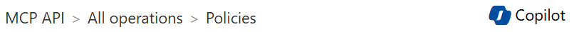

# Exercise 3: Review Agents Control Plane

**Duration:** 30 minutes

## Overview

In this exercise, you are to inspect the complete Azure Agents Control Plane to understand how identity, security, governance, memory, and observability of your new agent works and works work together. You will be asked answer some questions about the implementation.

---

## Step 3.1: Check APIM – Policies (Management/Governance)

Azure API Management enforces governance policies for all agent traffic.

### Navigate to APIM

1. Open Azure Portal
2. Navigate to **API Management** → Your APIM instance
3. Go to **APIs** → **MCP API** → **Design** → **Inbound processing**

### Ask Azure Copilot to answer some questions

Ask Azure Copilot:




| Question | Copilot/Your Answer |
|----------|-------------|
| What does this APIM say? | |
| What happens if an unauthenticated request is made to an endpoint in this APIM? | |
| What is the rate limit per minute for the APIs in this APIM? | |
| What is the daily quota for this APIM? | |
| How are requests traced across services and through this APIM? | |

---

## Step 3.2: Check Cosmos DB (Short-Term Memory)

Cosmos DB stores plans, tasks, and agent episodes.

### Navigate to Cosmos DB

1. Open Azure Portal
2. Navigate to **Azure Cosmos DB** → Your account
3. Go to **Data Explorer**

### View Plans and Tasks

Click on plans and then Items.

Review tasks, intent and steps.

Click on tasks and then Items.

Review embeddings.

### View Plans and Tasks

Click on plans and then Items.

Review tasks, intent and steps.

Click on tasks and then Items.

Review embeddings.

### View Reinforcement Learning Episodes

Click on rl_episodes and then Items.

Review episodes.

---

## Step 3.3: Check Azure AI Foundry / AI Search (Long-Term Memory)

Azure AI Search provides vector search for long-term memory retrieval.

### Navigate to AI Search

1. Open Azure Portal
2. Navigate to **Azure AI Search** → Your service
3. Go to **Indexes** → **agent-memory**

### Run a Search Query

```http
POST https://{search-service}.search.windows.net/indexes/agent-memory/docs/search?api-version=2024-07-01
Content-Type: application/json
api-key: {your-key}

{
  "search": "autonomous-agent",
  "select": "agent_id, content, timestamp",
  "top": 10,
  "orderby": "timestamp desc"
}
```

### Review AI Foundry Connection

```powershell
# Check Foundry endpoint
$env:FOUNDRY_PROJECT_ENDPOINT

# Test connection
az ai foundry project show --name <project-name> --resource-group <rg>
```

---

## Step 3.4: Check Fabric IQ / Storage Account (Facts/Ontology)

Ontologies provide grounded facts for agent reasoning.

### Navigate to Storage Account

1. Open Azure Portal
2. Navigate to **Storage Account** → Your account
3. Go to **Containers** → **ontologies**

### Review Ontology Files

```powershell
# List ontology files
az storage blob list --account-name <storage> --container-name ontologies --output table

# Download and review an ontology
az storage blob download --account-name <storage> --container-name ontologies --name customer_churn_ontology.json --file ./ontology.json

# View the ontology structure
Get-Content ./ontology.json | ConvertFrom-Json | Format-List
```

### Ontology Structure

```json
{
  "name": "customer_churn",
  "version": "1.0.0",
  "entities": ["Customer", "Product", "Subscription"],
  "relationships": ["purchases", "subscribes_to"],
  "facts": [
    {"subject": "Customer", "predicate": "has_churn_risk", "object": "ChurnScore"}
  ]
}
```

---

## Step 3.5: Check Log Analytics (Observability)

Azure Monitor collects logs, metrics, and traces from all agents.

### Navigate to Log Analytics

1. Open Azure Portal
2. Navigate to **Log Analytics** → Your workspace
3. Go to **Logs**

### Query Agent Logs

```kusto
// Agent container logs
ContainerLogV2
| where ContainerName contains "agent"
| where TimeGenerated > ago(1h)
| project TimeGenerated, ContainerName, LogMessage
| order by TimeGenerated desc
| take 100
```

### Query API Requests

```kusto
// APIM request logs
ApiManagementGatewayLogs
| where TimeGenerated > ago(1h)
| where OperationName contains "tools"
| project TimeGenerated, OperationName, ResponseCode, DurationMs
| order by TimeGenerated desc
```

---

## Step 3.6: Review Metrics and Traces via Azure Monitor and App Insights

### Navigate to Application Insights

1. Open Azure Portal
2. Navigate to **Application Insights** → Your instance
3. Go to **Transaction Search**

### View Distributed Traces

Filter by:
- **Operation Name:** `POST /message`
- **Time Range:** Last 1 hour

Click on a transaction to view the end-to-end trace.

### Query Custom Metrics

```kusto
// Tool call latency
customMetrics
| where name == "tool_call_duration_ms"
| summarize avg(value), percentile(value, 95), percentile(value, 99) by bin(timestamp, 5m)
| render timechart
```

### Query Error Rates

```kusto
// Error rate by agent
requests
| where timestamp > ago(1h)
| summarize 
    TotalRequests = count(),
    FailedRequests = countif(success == false),
    ErrorRate = round(countif(success == false) * 100.0 / count(), 2)
  by cloud_RoleName
| order by ErrorRate desc
```

---

## Step 3.7: Check Entra ID / RBAC

### Navigate to Entra ID

1. Open Azure Portal
2. Navigate to **Microsoft Entra ID** → **App registrations**
3. Find your agent's managed identity

### Review Role Assignments

```powershell
# List role assignments for agent identity
az role assignment list --assignee <agent-managed-identity-client-id> --all --output table
```

### Expected Roles

| Role | Resource | Purpose |
|------|----------|---------|
| Cognitive Services User | AI Foundry | LLM inference |
| Cosmos DB Data Contributor | Cosmos DB | Read/write sessions |
| Storage Blob Data Reader | Storage Account | Read ontologies |
| Search Index Data Reader | AI Search | Query long-term memory |

### Verify Workload Identity

```powershell
# Check service account annotation
kubectl get serviceaccount autonomous-agent-sa -n mcp-agents -o yaml

# Expected annotation:
# azure.workload.identity/client-id: <managed-identity-client-id>
```

---

## Step 3.8: Identify Problems

Based on your review, identify any issues with your agents:

### Checklist

| Component | Status | Issue Found | Notes |
|-----------|--------|-------------|-------|
| APIM Policies | ✅ / ❌ | | |
| Cosmos DB Sessions | ✅ / ❌ | | |
| AI Search Memory | ✅ / ❌ | | |
| Ontology Storage | ✅ / ❌ | | |
| Log Analytics | ✅ / ❌ | | |
| App Insights Traces | ✅ / ❌ | | |
| Entra ID RBAC | ✅ / ❌ | | |

### Common Problems

| Problem | Symptom | Solution |
|---------|---------|----------|
| High latency | P95 > 2s | Check AI Foundry throttling, scale pods |
| Failed tool calls | Error rate > 5% | Review logs for exceptions |
| Missing traces | No transactions in App Insights | Verify OpenTelemetry configuration |
| RBAC errors | 403 responses | Add missing role assignments |


### Document Findings

Record any problems found for resolution in Exercise 4:

```
Problem 1: ___________________________________________
Symptom: ____________________________________________
Suspected Cause: ____________________________________

Problem 2: ___________________________________________
Symptom: ____________________________________________
Suspected Cause: ____________________________________
```

---

## Verification Checklist

- [ ] Reviewed APIM policies and understand governance controls
- [ ] Verified Cosmos DB is storing sessions and episodes
- [ ] Confirmed AI Search has agent memory data
- [ ] Reviewed ontology files in storage
- [ ] Queried Log Analytics for agent logs
- [ ] Viewed distributed traces in App Insights
- [ ] Verified RBAC role assignments
- [ ] Documented any problems found

---

**Next:** [Exercise 4: Fine-Tune Agent](exercise_04_fine_tune_agent.md)
